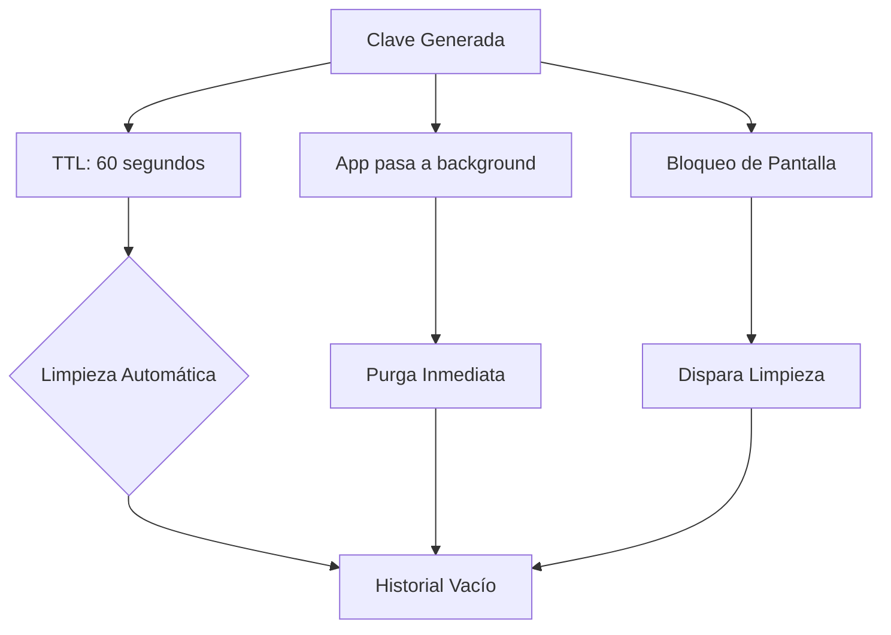

# 📱 CalixAuth - Resumen Completo del Proyecto

## 🎯 Propósito del Proyecto

**CalixAuth** es un generador de claves efímeras desarrollado por **HyM Soft**, liderado por Hugo Antonio Segura. Su filosofía central es el concepto de **"Usar y Olvidar"**: generar claves efímeras robustas en dispositivos móviles sin el riesgo de almacenamiento persistente inseguro.

A diferencia de los gestores tradicionales que sincronizan todo en la nube, CalixAuth proporciona una herramienta instantánea (carga < 2s) que permite generar, copiar y descartar credenciales, manteniéndolas en memoria solo el tiempo estrictamente necesario.

---

## 🏗️ Arquitectura Técnica

### Stack Tecnológico

- **Framework:** React Native (Expo SDK 52+)
- **Lenguaje:** TypeScript (estricto)
- **Routing:** Expo Router v4 (file-based routing)
- **Gestión de Estado:** Zustand (ligero, sin boilerplate)
- **Criptografía:** `expo-crypto` (CSPRNG)
- **Internacionalización:** i18next con react-i18next
- **Pagos:** react-native-purchases (RevenueCat)

### Estructura de Directorios

```bash
/calixauth
├── /assets              # Fuentes, Iconos, Logos (HyM Soft)
├── /src
│   ├── /components      # UI Kit (Botones, Sliders, Cards, FeedbackHaptic)
│   ├── /constants       # Paletas de colores, Configuración Global
│   ├── /hooks           # usePasswordGenerator, useInAppPurchase
│   ├── /i18n            # Configuración y diccionarios (ES, EN, FR, PT)
│   ├── /store           # Stores de Zustand (authStore, settingsStore)
│   ├── /utils           # Helpers de criptografía y formateo
│   └── /types           # Definiciones de TypeScript compartidas
├── /app                 # Expo Router
│   ├── _layout.tsx      # Provider wrappers (I18n, Theme)
│   └── index.tsx        # Pantalla Principal (Dashboard)
├── app.json             # Configuración de Expo
├── tsconfig.json        # Configuración de TypeScript
└── package.json
```

---

## ✨ Características Principales (Historias de Usuario)

| ID       | Usuario | Quiero...                                        | Para...                                                |
| -------- | ------- | ------------------------------------------------ | ------------------------------------------------------ |
| **US.1** | Usuario | Configurar la longitud y tipo de caracteres      | Adaptar la clave a los requisitos de diferentes sitios |
| **US.2** | Usuario | Presionar un botón central para generar la clave | Obtener una clave nueva de forma rápida                |
| **US.3** | Usuario | Copiar la clave al portapapeles con un toque     | Pegarla fácilmente en otra aplicación                  |
| **US.4** | Usuario | Ver las últimas 5 claves generadas               | Recuperar una clave si olvidé pegarla a tiempo         |
| **US.5** | Usuario | Cambiar el idioma (ES/EN/FR/PT)             | Usar la app en mi lengua nativa                        |
| **US.6** | Usuario | Donar 1 USD ("Invítame un café")                 | Apoyar el desarrollo de HyM Soft de forma voluntaria   |

---

## 📋 Requisitos No Funcionales

- **Seguridad:** Uso obligatorio de **CSPRNG** (`expo-crypto`). IDs generados con `randomUUID()`.
- **Calidad de Código:** Suite de 13 tests unitarios (Jest). Cobertura de lógica de negocio >70%.
- **Resiliencia:** Implementación de **Error Boundaries** para capturar fallos de renderizado.
- **Privacidad:** **Cero persistencia** en almacenamiento permanente para datos sensibles.
- **Rendimiento:** TTI inferior a **2 segundos**.
- **Mantenibilidad:** ESLint (Flat Config) y Prettier configurados.

---

## 🎨 Diseño y Estética

### Paleta de Colores "Azul Cronos"

| Token             | Valor HEX             | Uso                                                |
| ----------------- | --------------------- | -------------------------------------------------- |
| `primary`         | `#0077B6`             | Botón de Acción Principal (Generar), Links activos |
| `backgroundDark`  | `#1C222B`             | Fondo principal en Modo Oscuro                     |
| `backgroundLight` | `#F1F7FB`             | Fondo principal en Modo Claro                      |
| `surfaceDark`     | `#262D38`             | Tarjetas y modales en oscuros                      |
| `textPrimary`     | `#FFFFFF` / `#1A1C20` | Texto principal (Dark / Light)                     |

### Comportamiento Visual

- **Feedback Visual:** Micro-animación de "presión" al tocar botones
- **Feedback Háptico:** Vibración sutil (`expo-haptics`) al generar clave y copiar

---

## 🔐 Seguridad y Privacidad

### Algoritmo de Generación

- **CSPRNG:** `Crypto.getRandomValues()` a través de `expo-crypto`
- **Parámetros:**
  - Longitud: 8 a 32 caracteres
  - Alfabetos: Mayúsculas (A-Z), Minúsculas (a-z), Números (0-9), Símbolos (!@#$%^&*...)

### Gestión de Memoria Volátil (Estrategia HyM)



**Reglas de Limpieza:**

1. **TTL:** Cada clave tiene vida útil de **60 segundos**
2. **Lifecycle Trigger:** Al pasar a `background` o `inactive`, el historial se purga
3. **Bloqueo de Pantalla:** Dispara la limpieza inmediatamente
4. **Clipboard:** Intentar limpiar después de 60 segundos (best effort en Android 10+)

---

## 💰 Monetización

### Producto: "Invítame un café"

- **Modelo:** Donación voluntaria (In-App Purchase consumible)
- **Precio:** Tier 1 de Google Play (~1.00 USD)
- **Proveedor:** **RevenueCat** (abstrae complejidad de validación de recibos)

### Flujo de Usuario

1. Usuario toca el ícono de "Engranaje" -> Selección de "Regálame un café"
2. Modal nativo explicando la donación
3. Inicio del flujo de compra de Google Play
4. Al completar (`PURCHASED`), animación de agradecimiento
5. **No se desbloquean funciones extra** - es puramente altruista

---

## 📅 Roadmap de Desarrollo (MVP v1.0.0)

### Fase 1: Cimientos ✅

- [x] Inicializar proyecto con Expo + TypeScript
- [x] Configurar Expo Router
- [x] Configurar Zustand para gestión de estado
- [x] Implementar sistema de i18n con soporte ES/EN/FR/PT

### Fase 2: Lógica Core ✅

- [x] Implementar servicio de generación con `expo-crypto`
- [x] Crear Store de Zustand para configuración (longitud, caracteres)
- [x] Crear Store de Zustand para historial volátil

### Fase 3: UI/UX ✅

- [x] Implementar tokens de diseño (Colores OKLCH)
- [x] Construir pantalla principal (Inputs, Sliders, Botón Generar)
- [x] Implementar lista de historial con animación de entrada
- [x] Implementar menú de ajustes centralizado (SettingsMenu)

### Fase 4: Seguridad y Ciclo de Vida 🔄

- [x] Implementar limpieza automática por TTL (60 segundos)
- [x] Conectar `AppState` para limpiar datos al salir de la app
- [x] Probar persistencia cero (reiniciar app y verificar estado limpio)

### Fase 5: Monetización 📋

- [ ] Configurar cuenta en RevenueCat
- [ ] Integrar `react-native-purchases`
- [ ] Implementar flujo de donación

### Fase 7: Auditoría y Sostenibilidad ✅

- [x] Sanitización de logs en producción.
- [x] Refactor de tipos y validación de seguridad en stores.
- [x] Configuración de Jest y suite de 13 tests unitarios.
- [x] Implementación de Error Boundaries.
- [x] Manejo de errores en enlaces externos y limpieza de inicialización.
- [x] Creación de Toast multiplataforma.

---

## 🏷️ Estrategia de Versionado

### Formato: `V Major.Minor.Patch-build.DDMMYYHHMM`

- **V:** Prefijo literal "V" mayúscula
- **Major (X):** Cambios disruptivos o reescrituras completas (inicio: `1`)
- **Minor (Y):** Nuevas funcionalidades importantes (inicio: `0`)
- **Patch (Z):** Parches o correcciones menores (inicio: `0`)
- **build:** Literal "build" minúscula
- **DDMMYYHHMM:** Fecha y hora de compilación en formato `DDMMYYHHMM`

### Ejemplo

Si hoy es **28 de Enero de 2026 a las 11:13**:  
Versión: **`V 1.0.0-build.2801261113`**

### Automatización

Script `scripts/set-version.js` ejecuta en pre-build para actualizar automáticamente:

- `version`: `V 1.0.0-build.2801261113`
- `android.versionCode`: `2801261113`
- `ios.buildNumber`: `V 1.0.0-build.2801261113`

---

## 📍 Estado Actual del Proyecto

**CalixAuth** ha superado una auditoría técnica profunda, alcanzando un nivel de madurez **Producción-Ready**. El proyecto no solo es funcional y estéticamente superior, sino que ahora cuenta con una base de código sólida, testeada y resiliente ante errores. La versión actual es **1.0.0**.
